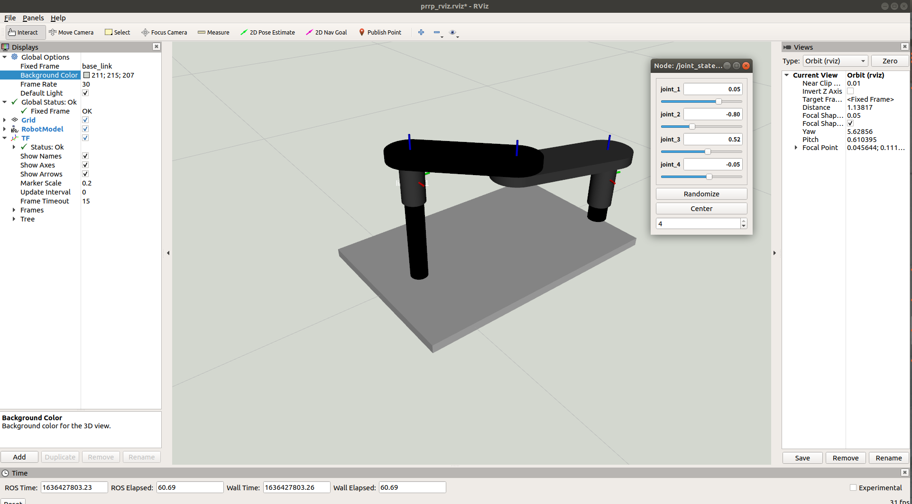
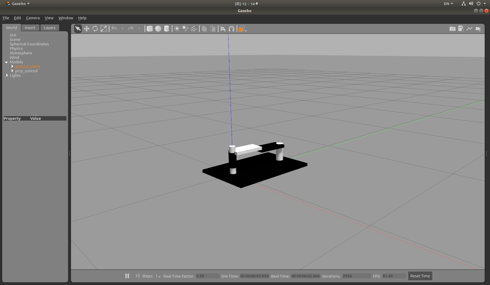

# RSD_project_B

Project of RT750 robot system implementation

## rviz implemntation of prrp robot
To implement rviz simulation, 
    
    roslaunch rsd_description prrp_rviz.launch

Using joint_state_publisher_gui package, you can adjust joint values.
### Joint limit given in URDF
- joint 1: -0.1 ~ 0.1
- joint 2: -pi ~ pi
- joint 3: -pi ~ pi
- joint 4: -0.1 ~ -0.01

## Gazebo implementation of prrp robot
To implement Gazebo simulation,

    roslaunch rsd_simulation gazebo_prrp_control.launch

simulation model of Gazebo became stable using xacro file format and setting inertia.

### Issues
- During controlling joints in prrp manipulator, some joints does not work as wish. (ex. joint_1, joint_2) 
### ToDo
- Need to tune P I D paramters